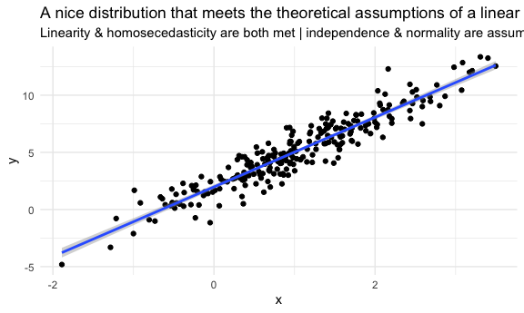
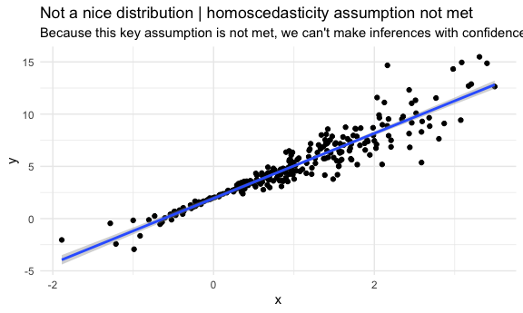

boostrapping
================

## Simulate data

``` r
n_samp = 250

sim_df_const = 
  tibble(
    x = rnorm(n_samp, 1, 1),
    error = rnorm(n_samp, 0, 1),
    y = 2 + 3 * x + error
  )

sim_df_nonconst = sim_df_const %>% 
  mutate(
  error = error * .75 * x,
  y = 2 + 3 * x + error
)
```

Plot the datasets

``` r
sim_df_const %>% 
  ggplot(aes(x = x, y = y)) + 
  geom_point() + 
  geom_smooth(method = "lm") + 
  labs(
    title = "A nice distribution that meets the theoretical assumptions of a linear regression", 
    subtitle = "Linearity & homosecedasticity are both met | independence & normality are assumed"
  )
```

    ## `geom_smooth()` using formula 'y ~ x'



``` r
sim_df_nonconst %>% 
  ggplot(aes(x = x, y = y)) + 
  geom_point() + 
  geom_smooth(method = "lm") + 
  labs(
    title = "Not a nice distribution | homoscedasticity assumption not met", 
    subtitle = "Because this key assumption is not met, we can't make inferences with confidence"
  )
```

    ## `geom_smooth()` using formula 'y ~ x'



Check the parameter estimates (standard error, estimates etc … ) The lm
function gives us these estimates assuming that our statistical
assumptions have been met on our data

``` r
lm(y ~ x, data = sim_df_const) %>% broom::tidy()
```

    ## # A tibble: 2 x 5
    ##   term        estimate std.error statistic   p.value
    ##   <chr>          <dbl>     <dbl>     <dbl>     <dbl>
    ## 1 (Intercept)     1.98    0.0981      20.2 3.65e- 54
    ## 2 x               3.04    0.0699      43.5 3.84e-118

``` r
lm(y ~ x, data = sim_df_nonconst) %>% broom::tidy()
```

    ## # A tibble: 2 x 5
    ##   term        estimate std.error statistic   p.value
    ##   <chr>          <dbl>     <dbl>     <dbl>     <dbl>
    ## 1 (Intercept)     1.93    0.105       18.5 1.88e- 48
    ## 2 x               3.11    0.0747      41.7 5.76e-114

Even though the error terms for `sim_df_nonconst` vary widely compared
to the error terms of the `sim_df_const`, the std.error that our `lm`
gave us was similar for both models. THIS is the problem we’re trying to
solve with `Boostrapping` … when we can’t make theoretical assumptions
(our keys assumptions have been violated) we rely on `bootsrapping` to
get a sense for the distribution our data follows using emprical
evidence.

`boostrap` time

## Draw one bootstrap sample

Writing a function that takes a bootstrap sample from a given dataset

``` r
boot_sample = function(df) {
  
  sample_frac(df, size = 1, replace = TRUE) %>% 
    arrange(x)
  
  #size = 1 specifies that we want to draw a sample the same size as our dataframe & replace = TRUE tells is that we want to draw samples with replacements, such that multiple obs may be resampled. 
  # Why do we want it to be the same size? because our variance estimates (& vis a vi our confidence intervals) are dependent on sample size. That's why we "size = 1" 
  
}
```

Check if this works … Plotty plot

``` r
boot_sample(sim_df_nonconst) %>%  
  ggplot(aes(x = x, y = y)) + 
  geom_point(alpha = .3) + 
  geom_smooth(method = "lm") + 
  ylim(-5, 16)
```

    ## `geom_smooth()` using formula 'y ~ x'


When you rerun the bootstrapping you get different estimates/slopes
because bootrstapping (re)samples randomly

``` r
boot_sample(sim_df_nonconst) %>%  
   lm(y ~ x, data = .) %>% 
  broom::tidy()
```

    ## # A tibble: 2 x 5
    ##   term        estimate std.error statistic   p.value
    ##   <chr>          <dbl>     <dbl>     <dbl>     <dbl>
    ## 1 (Intercept)     1.90    0.0982      19.3 2.45e- 51
    ## 2 x               3.14    0.0688      45.6 1.18e-122
