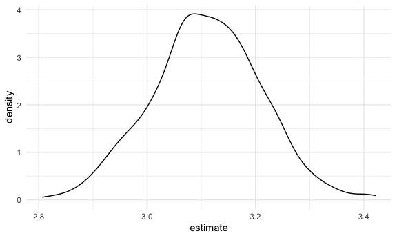

boostrapping
================

## Simulate data

``` r
n_samp = 250

sim_df_const = 
  tibble(
    x = rnorm(n_samp, 1, 1),
    error = rnorm(n_samp, 0, 1),
    y = 2 + 3 * x + error
  )

sim_df_nonconst = sim_df_const %>% 
  mutate(
  error = error * .75 * x,
  y = 2 + 3 * x + error
)
```

Plot the datasets

``` r
sim_df_const %>% 
  ggplot(aes(x = x, y = y)) + 
  geom_point() + 
  geom_smooth(method = "lm") + 
  labs(
    title = "A nice distribution that meets the theoretical assumptions of a linear regression", 
    subtitle = "Linearity & homosecedasticity are both met | independence & normality are assumed"
  )
```

    ## `geom_smooth()` using formula 'y ~ x'


``` r
sim_df_nonconst %>% 
  ggplot(aes(x = x, y = y)) + 
  geom_point() + 
  geom_smooth(method = "lm") + 
  labs(
    title = "Not a nice distribution | homoscedasticity assumption not met", 
    subtitle = "Because this key assumption is not met, we can't make inferences with confidence"
  )
```

    ## `geom_smooth()` using formula 'y ~ x'


Check the parameter estimates (standard error, estimates etc … ) The lm
function gives us these estimates assuming that our statistical
assumptions have been met on our data

``` r
lm(y ~ x, data = sim_df_const) %>% broom::tidy()
```

    ## # A tibble: 2 x 5
    ##   term        estimate std.error statistic   p.value
    ##   <chr>          <dbl>     <dbl>     <dbl>     <dbl>
    ## 1 (Intercept)     1.98    0.0981      20.2 3.65e- 54
    ## 2 x               3.04    0.0699      43.5 3.84e-118

``` r
lm(y ~ x, data = sim_df_nonconst) %>% broom::tidy()
```

    ## # A tibble: 2 x 5
    ##   term        estimate std.error statistic   p.value
    ##   <chr>          <dbl>     <dbl>     <dbl>     <dbl>
    ## 1 (Intercept)     1.93    0.105       18.5 1.88e- 48
    ## 2 x               3.11    0.0747      41.7 5.76e-114

Even though the error terms for `sim_df_nonconst` vary widely compared
to the error terms of the `sim_df_const`, the std.error that our `lm`
gave us was similar for both models. THIS is the problem we’re trying to
solve with `Boostrapping` … when we can’t make theoretical assumptions
(our keys assumptions have been violated) we rely on `bootsrapping` to
get a sense for the distribution our data follows using emprical
evidence.

`boostrap` time

## Draw one bootstrap sample

Writing a function that takes a bootstrap sample from a given dataset

``` r
boot_sample = function(df) {
  
  sample_frac(df, size = 1, replace = TRUE) %>% 
    arrange(x)
  
  #size = 1 specifies that we want to draw a sample the same size as our dataframe & replace = TRUE tells is that we want to draw samples with replacements, such that multiple obs may be resampled. 
  # Why do we want it to be the same size? because our variance estimates (& vis a vi our confidence intervals) are dependent on sample size. That's why we "size = 1" 
  
}
```

Check if this works … Plotty plot

``` r
boot_sample(sim_df_nonconst) %>%  
  ggplot(aes(x = x, y = y)) + 
  geom_point(alpha = .3) + 
  geom_smooth(method = "lm") + 
  ylim(-5, 16)
```

    ## `geom_smooth()` using formula 'y ~ x'


When you rerun the bootstrapping you get different estimates/slopes
because bootrstapping (re)samples randomly

``` r
boot_sample(sim_df_nonconst) %>%  
   lm(y ~ x, data = .) %>% 
  broom::tidy()
```

    ## # A tibble: 2 x 5
    ##   term        estimate std.error statistic   p.value
    ##   <chr>          <dbl>     <dbl>     <dbl>     <dbl>
    ## 1 (Intercept)     1.90    0.0982      19.3 2.45e- 51
    ## 2 x               3.14    0.0688      45.6 1.18e-122

## Many samples and analysis

``` r
boot_straps = 
  tibble(
    strap_number = 1:1000,
    strap_sample = rerun(1000, boot_sample(sim_df_nonconst))
  )
```

Can I run my analysis on these … ? yes\! using stuff we’ve used before

``` r
boot_results = 
  boot_straps %>% 
  mutate(
    models = map(.x = strap_sample, ~lm(y ~ x, data = .x)),
    results = map(models, broom::tidy)
  ) %>% 
  select(strap_number, results) %>% 
  unnest(results)
```

What do I have now?

We now want to know the distribution of the estimated intercept and
estimated coefficient (slope)

Compare the error of the estimate and the slope you got from the
bootstrap samples to the error terms you got from the linear models:

Notice how the std.errors you get from the bootsrap model better
approximate the distribution of the error terms we see in
`sim_df_nonconst` (check scatter plot) with a lower std.error around the
intercept & a larger std.error for the slope oi

``` r
boot_results %>% 
  group_by(term) %>% 
  summarize(
    mean_est  = mean(estimate), #1st moment
    sd_est = sd(estimate) #3rd (?) moment
  )
```

    ## `summarise()` ungrouping output (override with `.groups` argument)

    ## # A tibble: 2 x 3
    ##   term        mean_est sd_est
    ##   <chr>          <dbl>  <dbl>
    ## 1 (Intercept)     1.93 0.0748
    ## 2 x               3.11 0.101

``` r
lm(y ~ x, data = sim_df_nonconst) %>% broom::tidy()
```

    ## # A tibble: 2 x 5
    ##   term        estimate std.error statistic   p.value
    ##   <chr>          <dbl>     <dbl>     <dbl>     <dbl>
    ## 1 (Intercept)     1.93    0.105       18.5 1.88e- 48
    ## 2 x               3.11    0.0747      41.7 5.76e-114

What we can then do is go ahead and construct the confidence intervals
using the bootstrap results

First, let’s look at the distributions of the estimate

``` r
boot_results %>% 
  filter(term == "x") %>% 
  ggplot(aes(x = estimate)) + 
  geom_density()
```



Under bootstrapping, i.e., under repeated sampling, without relying on
any theoretical assumptions, the distributions of the estimated slope
(`x`) looks like this ^^ …. so now, if I want to construct confidence
intervals, I can go to the tail ends, and “chop-off” or set cut-off
points at 2.5% of the distribution, as it were.

construct boostrap CI

``` r
boot_results %>% 
  group_by(term) %>% 
  summarize(
    ci_lower = quantile(estimate, 0.025), # quantile() gives me the quantiles of the estimates at 2.5% 
    ci_upper = quantile(estimate, 0.975)  # quantile() gives me the quantiles of the estimates at 97.5% 
  )
```

    ## `summarise()` ungrouping output (override with `.groups` argument)

    ## # A tibble: 2 x 3
    ##   term        ci_lower ci_upper
    ##   <chr>          <dbl>    <dbl>
    ## 1 (Intercept)     1.79     2.08
    ## 2 x               2.91     3.31

## Bootstrap using modelr

Can we simplify anything from the above

The function `bootstrap` in `modelr` carries out lets us bootstrap from
a given dataset … which is essentially what we did with our function
`boot_sample`

Note how the `bootstrap` function gives us a “tibble” object instead of
a `tibble`

``` r
sim_df_nonconst %>% 
  bootstrap(1000, id = "strap_number") %>% 
  mutate(
    models = map(.x = strap, ~lm(y ~ x, data = .x)),
    results = map(models, broom::tidy)
  ) %>% 
  select(strap_number, results) %>% 
  unnest(results)  %>%  
  group_by(term) %>% 
  summarize(
    mean_est  = mean(estimate), #1st moment
    sd_est = sd(estimate) #3rd (?) moment
  )
```

    ## `summarise()` ungrouping output (override with `.groups` argument)

    ## # A tibble: 2 x 3
    ##   term        mean_est sd_est
    ##   <chr>          <dbl>  <dbl>
    ## 1 (Intercept)     1.93 0.0762
    ## 2 x               3.11 0.104

``` r
#we do what we did earlier with bootstrapping and so on here but this time only with 12 lines of code. 
```

Compare the estimates you get from bootstrapping over sim\_df\_const to
the estimates you get when running a lm() on sim\_df\_const

Let’s revisit `nyc_airbnb`

``` r
data("nyc_airbnb")

nyc_airbnb = 
  nyc_airbnb %>% 
  mutate(stars = review_scores_location / 2) %>% 
  rename(
    borough = neighbourhood_group,
    neighborhood = neighbourhood) %>% 
  filter(borough != "Staten Island") %>% # not enough data points in staten island so we take it out 
  select(price, stars, borough, neighborhood, room_type)
```

Plots stars & price

``` r
nyc_airbnb %>% 
  ggplot(aes(x = stars, y = price)) + 
  geom_point() + 
  labs(
    title = "Price vs. Stars", 
    subtitle = "Note how we don't observe constant variance " # so what would be nice is we can bootstrap to get an empirical sense of the type of distribution our data is actually following
  )
```

    ## Warning: Removed 9962 rows containing missing values (geom_point).


Let’s just focus on “Manhattan”

``` r
nyc_airbnb  %>% 
  filter(borough == "Manhattan") %>% 
  drop_na(stars) %>% 
  ggplot(aes(x = stars, y = price)) + 
  geom_point() + 
   labs(
    title = "Manhattan: Price vs. Stars", 
    subtitle = "Still, a clearly non-constant variance "
  )
```


Next steps: 1- bootstrap, 2 - fit a regression on these bootstrap
samples of `price` \~ `stars` 3 - then get an estimate

``` r
airbnb_boot_results = nyc_airbnb  %>% 
  filter(borough == "Manhattan") %>% 
  drop_na(stars) %>%  
  bootstrap(1000, id = "strap_number") %>% 
  mutate(
    models = map(.x = strap, ~lm(price ~ stars, data = .x)),
    results = map(models, broom::tidy)
  ) %>% 
  select(strap_number, results) %>% 
  unnest(results) 

airbnb_boot_results %>% 
  group_by(term) %>% 
  summarize(
    mean_est  = mean(estimate), 
    sd_est = sd(estimate) 
  )
```

    ## `summarise()` ungrouping output (override with `.groups` argument)

    ## # A tibble: 2 x 3
    ##   term        mean_est sd_est
    ##   <chr>          <dbl>  <dbl>
    ## 1 (Intercept)    -35.0  31.8 
    ## 2 stars           43.4   6.43

Let’s compare this ^ to lm :

``` r
nyc_airbnb  %>% 
  filter(borough == "Manhattan") %>% 
  drop_na(stars) %>% 
  lm(price ~ stars, data = .)  %>% #peep the [data = .] and how that let's the data in the previous lines be "piped"into the second argument. Telling the function to work with "this" dataset
  broom::tidy()
```

    ## # A tibble: 2 x 5
    ##   term        estimate std.error statistic  p.value
    ##   <chr>          <dbl>     <dbl>     <dbl>    <dbl>
    ## 1 (Intercept)    -34.3     22.9      -1.50 1.35e- 1
    ## 2 stars           43.3      4.78      9.07 1.39e-19

Note how the std.error is higher in the `bootstrap` samples than it is
for the `lm()`, which is what we’d expect because bootstrap doesn’t
assume constant variance as does the OLS method in `lm`

``` r
airbnb_boot_results %>% 
  filter(term == "stars") %>% 
  ggplot(aes(x = estimate)) + 
  geom_density() + 
  labs(
    title = "Distribution of Estimated slope under bootstrapping"
  )
```


