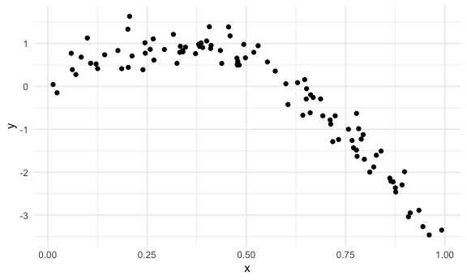
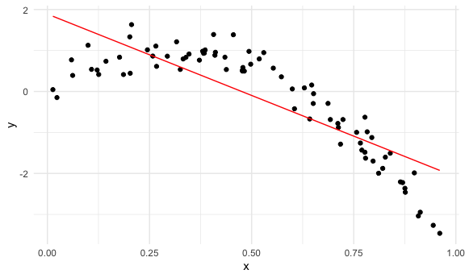
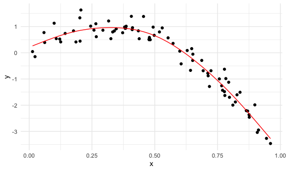
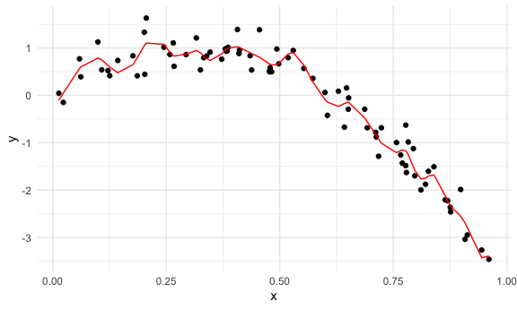

Cross Validation
================

# How Do You Choose the Best Model using prediction accuracy as a metric?

## Let’s start with simulated data

``` r
nonlin_df = 
  tibble( 
    id = 1:100, 
    x = runif(100, 0, 1),
    y = 1 - 10 * (x - .3) ^ 2 + rnorm(100, 0, .3)
    )
```

Look at the data

``` r
nonlin_df %>% 
  ggplot(aes(x = x, y = y)) +
  geom_point()
```



Two ways of doing cross validation: by “hand” & in an “automated”
fashion using modelr

## Cross validation – by “hand”

Get training and testing datasets

``` r
train_df = sample_n(nonlin_df, size = 80)
test_df = anti_join(nonlin_df, train_df, by = "id") #get all observationin nonlin_df that are not in train_df
```

Fit three models.

``` r
linear_mod = lm(y ~ x, data = train_df)
smooth_mod = gam(y ~ s(x), data = train_df) #gam stands for generalized additive model
wiggly_mod  = gam(y ~ s(x, k = 30), sp = 10e-6, data = train_df) #more like you're chasing every single point - overfit/wiggly
```

Can I see what I just did …

``` r
train_df %>% 
  add_predictions(linear_mod) %>%  #add_predictions adds the predicted values from that model
  ggplot(aes(x = x, y = y)) + 
  geom_point() + 
  geom_line(aes(y = pred), color = "red")
```



``` r
train_df %>% 
  add_predictions(smooth_mod) %>%  #add_predictions adds the predicted values from that model
  ggplot(aes(x = x, y = y)) + 
  geom_point() + 
  geom_line(aes(y = pred), color = "red")
```



``` r
train_df %>% 
  add_predictions(wiggly_mod) %>%  #add_predictions adds the predicted values from that model
  ggplot(aes(x = x, y = y)) + 
  geom_point() + 
  geom_line(aes(y = pred), color = "red")
```



## as a side we can use `gather_predictions` instead of doing `add_predicitons` for every.single.model.

``` r
train_df %>% 
  gather_predictions(linear_mod, smooth_mod, wiggly_mod) %>%  #gather_predictions to 'gather' the predicitons of several models at once. peep the data structure
  ggplot(aes(x = x, y = y)) + 
  geom_point() + 
  geom_line(aes(y = pred), color = "red") + 
  facet_grid(. ~ model)
```


Let’s asses the `prediciton accuracy` of these models using RMSE to see
how well our models fit the `test` dataset

Insert the `RMSE` function. The lower the `RMSE`, the better.

``` r
rmse(linear_mod, test_df)
```

    ## [1] 0.7052956

``` r
rmse(smooth_mod, test_df) # makes the best predictions according to the RMSE
```

    ## [1] 0.2221774

``` r
rmse(wiggly_mod, test_df)
```

    ## [1] 0.289051

# thought - is the RMSE we observed liable to what ended up being the training set vs. testing set? could test for this?
