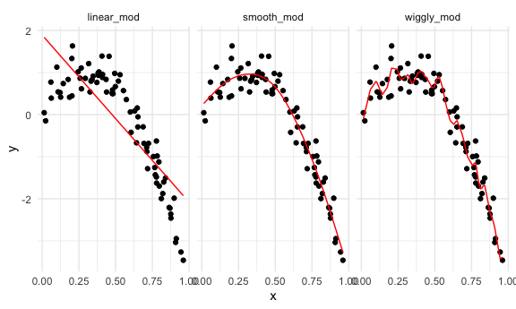

Cross Validation
================

# How Do You Choose the Best Model using prediction accuracy as a metric?

## Let’s start with simulated data

``` r
nonlin_df = 
  tibble( 
    id = 1:100, 
    x = runif(100, 0, 1),
    y = 1 - 10 * (x - .3) ^ 2 + rnorm(100, 0, .3)
    )
```

Look at the data

``` r
nonlin_df %>% 
  ggplot(aes(x = x, y = y)) +
  geom_point()
```


Two ways of doing cross validation: by “hand” & in an “automated”
fashion using modelr

## Cross validation – by “hand”

Get training and testing datasets

``` r
train_df = sample_n(nonlin_df, size = 80)
test_df = anti_join(nonlin_df, train_df, by = "id") #get all observationin nonlin_df that are not in train_df
```

Fit three models.

``` r
linear_mod = lm(y ~ x, data = train_df)
smooth_mod = gam(y ~ s(x), data = train_df) #gam stands for generalized additive model
wiggly_mod  = gam(y ~ s(x, k = 30), sp = 10e-6, data = train_df) #more like you're chasing every single point - overfit/wiggly
```

Can I see what I just did …

``` r
train_df %>% 
  add_predictions(linear_mod) %>%  #add_predictions adds the predicted values from that model
  ggplot(aes(x = x, y = y)) + 
  geom_point() + 
  geom_line(aes(y = pred), color = "red")
```


``` r
train_df %>% 
  add_predictions(smooth_mod) %>%  #add_predictions adds the predicted values from that model
  ggplot(aes(x = x, y = y)) + 
  geom_point() + 
  geom_line(aes(y = pred), color = "red")
```


``` r
train_df %>% 
  add_predictions(wiggly_mod) %>%  #add_predictions adds the predicted values from that model
  ggplot(aes(x = x, y = y)) + 
  geom_point() + 
  geom_line(aes(y = pred), color = "red")
```


## as a side we can use `gather_predictions` instead of doing `add_predicitons` for every.single.model.

``` r
train_df %>% 
  gather_predictions(linear_mod, smooth_mod, wiggly_mod) %>%  #gather_predictions to 'gather' the predicitons of several models at once. peep the data structure
  ggplot(aes(x = x, y = y)) + 
  geom_point() + 
  geom_line(aes(y = pred), color = "red") + 
  facet_grid(. ~ model)
```



Let’s asses the `prediciton accuracy` of these models using RMSE to see
how well our models fit the `test` dataset

Insert the `RMSE` function. The lower the `RMSE`, the better.

``` r
rmse(linear_mod, test_df)
```

    ## [1] 0.7052956

``` r
rmse(smooth_mod, test_df) # makes the best predictions according to the RMSE
```

    ## [1] 0.2221774

``` r
rmse(wiggly_mod, test_df)
```

    ## [1] 0.289051

# something to think about - is the RMSE we observed liable to what ended up being the training set vs. testing set? could test for this?

# Cross Validation using the `modelr` package

``` r
cv_df = 
  crossv_mc(nonlin_df, 100)
```

What is happening in `cv_df` ^^

``` r
cv_df %>% pull(train) %>% .[[1]] %>% as_tibble()
```

    ## # A tibble: 79 x 3
    ##       id      x       y
    ##    <int>  <dbl>   <dbl>
    ##  1     1 0.266   1.11  
    ##  2     2 0.372   0.764 
    ##  3     3 0.573   0.358 
    ##  4     4 0.908  -3.04  
    ##  5     6 0.898  -1.99  
    ##  6     7 0.945  -3.27  
    ##  7     8 0.661  -0.615 
    ##  8     9 0.629   0.0878
    ##  9    10 0.0618  0.392 
    ## 10    11 0.206   1.63  
    ## # … with 69 more rows

``` r
cv_df %>% pull(test) %>% .[[1]] %>% as_tibble()
```

    ## # A tibble: 21 x 3
    ##       id      x      y
    ##    <int>  <dbl>  <dbl>
    ##  1     5 0.202   1.33 
    ##  2    12 0.177   0.836
    ##  3    19 0.380   0.982
    ##  4    22 0.212   0.710
    ##  5    28 0.382   0.932
    ##  6    31 0.482   0.498
    ##  7    37 0.794  -1.12 
    ##  8    42 0.647   0.158
    ##  9    47 0.0233 -0.148
    ## 10    56 0.0995  1.13 
    ## # … with 11 more rows

``` r
cv_df = 
  cv_df %>% 
  mutate(
    train = map(train, as_tibble),
    test = map(test, as_tibble)
  )
```

Let’s try to fit models & get RMSEs for them.

``` r
cv_df = cv_df %>% 
  mutate(
    linear_mod = map(.x = train, ~lm(y ~ x, data = .x)),
    smooth_mod = map(.x = train, ~gam(y ~ s(x), data = .x)), 
    wiggly_mod = map(.x = train, ~gam(y ~ s(x, k = 30), sp = 10e-6, data = .x))
  ) %>% 
  mutate(
    rmse_linear = map2_dbl(.x = linear_mod, .y = test, ~rmse(model = .x, data = .y)),
    rmse_smooth = map2_dbl(.x = smooth_mod, .y = test, ~rmse(model = .x, data = .y)),
    rmse_wiggly = map2_dbl(.x = wiggly_mod, .y = test, ~rmse(model = .x, data = .y))
  )
```

What do these results say about model choices?

``` r
cv_df %>% 
  select(starts_with("rmse")) %>% 
  pivot_longer(
    everything(),
    names_to = "model",
    values_to = "rmse",
    names_prefix = "rmse_"
  ) %>% 
  ggplot(aes(x = model, y = rmse)) + 
  geom_violin() + 
  labs(
    title = "The Distribution of RMSEs across 100 training/testing splits fitting 3 different models", 
    subtitle = "The linear is the worst; Smooth model does the best"
  )
```


We could also compute RMSE averages

``` r
cv_df %>% 
  select(starts_with("rmse")) %>% 
  pivot_longer(
    everything(),
    names_to = "model",
    values_to = "rmse",
    names_prefix = "rmse_"
  ) %>% 
  group_by(model) %>% 
  summarize(
    avg_mse = mean(rmse))
```

    ## `summarise()` ungrouping output (override with `.groups` argument)

    ## # A tibble: 3 x 2
    ##   model  avg_mse
    ##   <chr>    <dbl>
    ## 1 linear   0.718
    ## 2 smooth   0.289
    ## 3 wiggly   0.354
